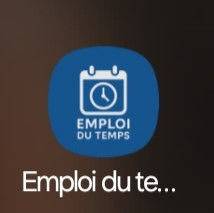

# 📅 Emploi du Temps UNC

**Application mobile Flutter** pour les étudiants de l’Université de la Nouvelle-Calédonie (UNC) :  
Consultez votre emploi du temps personnalisé, organisez des réunions entre étudiants et accédez à toutes les informations de vos cours, où que vous soyez.

---

## 🚀 Fonctionnalités principales

- 🧑‍🎓 **Connexion rapide** : Saisie de l'identifiant étudiant à l'ouverture.
- 🗓️ **Emploi du temps personnalisé** : Affichage clair par semaine, navigation entre semaines, tri automatique par jour.
- 🏫 **Détails complets** : Intitulé, salle, enseignant, horaires, type de cours.
- 🤝 **Organisation de réunions** : Trouvez facilement les créneaux communs libres entre plusieurs étudiants.
- 🇫🇷 **Interface 100% française** : Dates et heures au format local, gestion du fuseau horaire (Nouméa).
- 📱 **Design moderne** : Navigation fluide, cartes colorées, expérience utilisateur optimisée mobile.
Voici une version nettement améliorée de ta section **"📸 Aperçu de l’application"**, avec :

---

## 📸 Aperçu de l’application

<div align="center">




</div>

---

📥 **Télécharger l’application (Android uniquement)**
👉 [Cliquez ici pour récupérer l’APK](https://drive.google.com/file/d/1pu8xpEkScE7waXez33QuJm3siK-jk1dH/view?usp=sharing)

---

## 📦 Prérequis

- [Flutter SDK](https://flutter.dev/docs/get-started/install)
- [Dart SDK](https://dart.dev/get-dart)
- IDE recommandé :
  - [Android Studio](https://developer.android.com/studio) (avec un émulateur Android/iOS)
  - ou [Visual Studio Code](https://code.visualstudio.com/) (avec un appareil physique en mode développeur)
- Connexion Internet active (pour récupérer les emplois du temps)

---

## 🛠️ Dépendances principales

```yaml
dependencies:
  flutter:
    sdk: flutter
  http: ^0.13.5
  intl: ^0.18.1
  timezone: ^0.9.1
  collection: ^1.17.1
```

---

## 📁 Structure du projet

- `main.dart` – Point d’entrée de l’application.
- `app.dart` – Initialisation générale et navigation.
- `views/user_id_input_view.dart` – Vue de connexion (identifiant étudiant).
- `views/home_page.dart` – Vue principale (emploi du temps).
- `views/MeetingOrganizerView.dart` – Organisation de réunions et recherche de créneaux communs.
- `models/ics_event.dart` – Modèle de représentation des événements.
- `services/schedule_service.dart` – Récupération et parsing des données `.ics`.
- `widgets/drawer_menu.dart` – Menu latéral de navigation.
- `constants/strings.dart` – Constantes et textes de l’interface.

---

## ⚙️ Lancer le projet

1. **Cloner le dépôt** :
   ```bash
   git clone https://github.com/johnwaia/test_app.git
   ```
2. **Se rendre dans le répertoire** :
   ```bash
   cd test_app
   ```
3. **Installer les dépendances** :
   ```bash
   flutter pub get
   ```
4. **Vérifier la configuration de l’environnement** :
   ```bash
   flutter doctor
   ```
5. **Exécuter l’application** :
   ```bash
   flutter run
   ```

---

## 💡 Notes techniques

- Les événements sont extraits dynamiquement depuis un fichier `.ics` associé à l’identifiant étudiant.
- Le fuseau horaire utilisé est `Pacific/Noumea` pour correspondre à l’heure locale.
- L’application nécessite une connexion Internet active pour fonctionner.
- Le logo UNC s’affiche en grand lors du lancement de l’application (SplashScreen).

---

## 📄 Licence

Projet développé dans un cadre pédagogique à l’UNC.  
Licence à définir selon l’usage (ex. : MIT, GPL, etc.).

---
