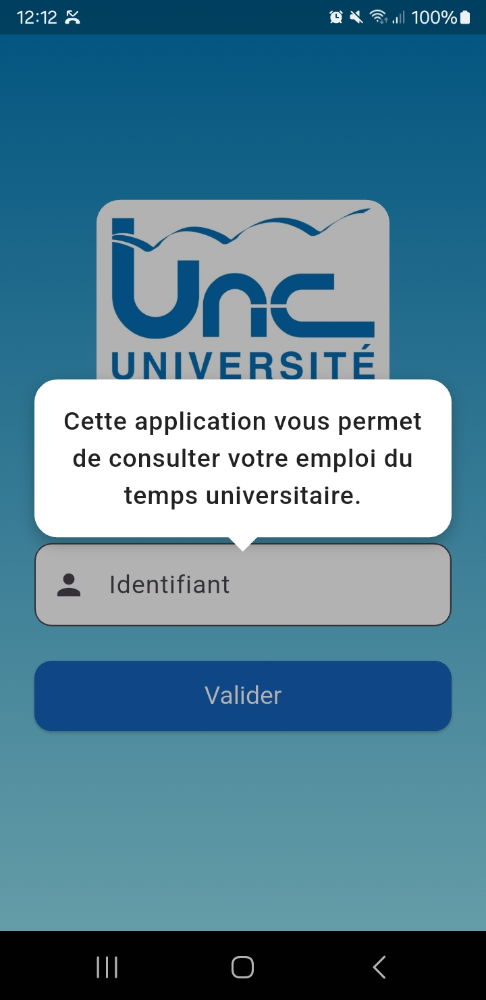
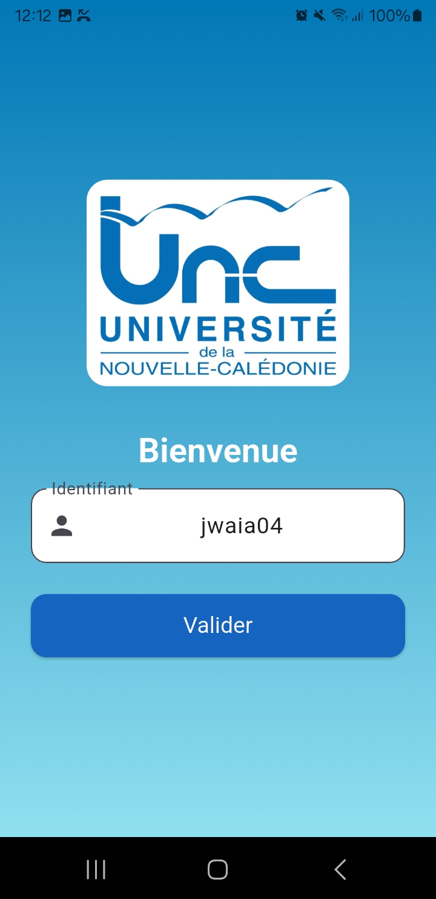
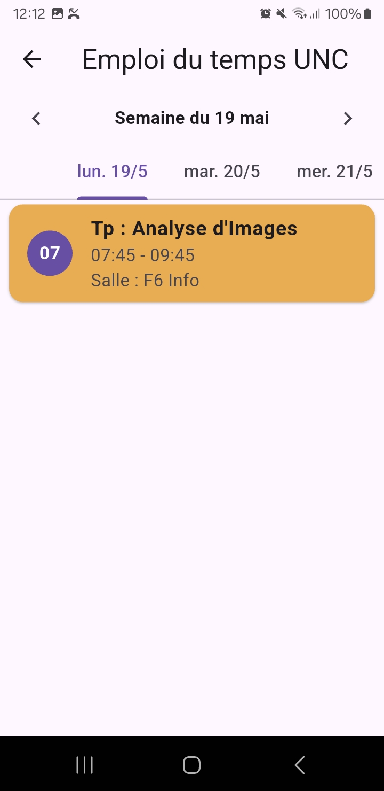
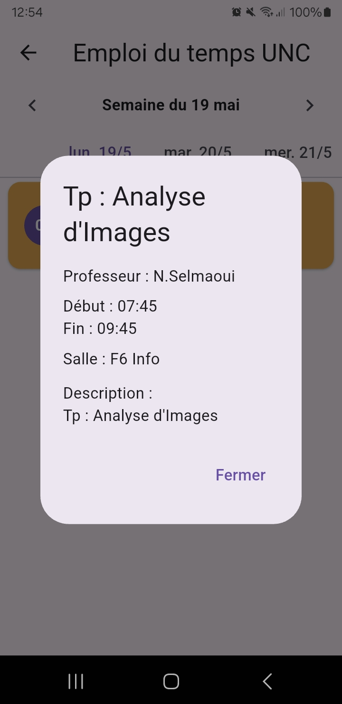

# 📅 Emploi du Temps – Université de la Nouvelle-Calédonie

**Application mobile Flutter** permettant aux étudiants de l’Université de la Nouvelle-Calédonie (UNC) de consulter facilement leur emploi du temps personnalisé à partir de leur identifiant étudiant.

---

## 🚀 Fonctionnalités

* 🧑‍🎓 Saisie de l'identifiant étudiant.
* 📆 Affichage en ligne de l’emploi du temps personnalisé.
* 📍 Détails complets pour chaque événement : intitulé, salle, enseignant, heure de début et de fin.
* 🗓️ Tri automatique des événements par jour, avec sélection possible de la semaine à consulter.
* 🇫🇷 Interface 100 % française, avec gestion du fuseau horaire (Nouméa) et format de date adapté.

---

## 📦 Prérequis

Avant de lancer le projet, assure-toi d’avoir installé les éléments suivants :

* [Flutter SDK](https://flutter.dev/docs/get-started/install)
* [Dart SDK](https://dart.dev/get-dart)
* IDE recommandé :

  * [Android Studio](https://developer.android.com/studio) (avec un émulateur Android/iOS)
  * ou [Visual Studio Code](https://code.visualstudio.com/) (avec un appareil physique en mode développeur)
* Connexion Internet active (pour récupérer les emplois du temps)

---

## 🛠️ Dépendances principales

Voici les packages Flutter utilisés :

```yaml
dependencies:
  flutter:
    sdk: flutter
  http: ^0.13.5
  intl: ^0.18.1
  timezone: ^0.9.1
  collection: ^1.17.1
```

---

## 📁 Structure principale du projet

* `main.dart` – Point d’entrée de l’application.
* `app.dart` – Initialisation générale et navigation.
* `views/user_id_input_view.dart` – Vue pour la saisie de l’identifiant étudiant.
* `views/home_page.dart` – Vue principale affichant les événements.
* `services/schedule_service.dart` – Récupération des données au format `.ics`.
* `models/ics_event.dart` – Modèle de représentation des événements.
* `constants/strings.dart` – Constantes et textes de l’interface.

---

## ⚙️ Lancer le projet

1. **Cloner le dépôt** :

   ```bash
   git clone https://github.com/johnwaia/test_app.git
   ```

2. **Se rendre dans le répertoire** :

   ```bash
   cd test_app
   ```

3. **Installer les dépendances** :

   ```bash
   flutter pub get
   ```

4. **Vérifier la configuration de l’environnement** :

   ```bash
   flutter doctor
   ```

5. **Exécuter l’application** :

   ```bash
   flutter run
   ```

---

## 📸 Captures d’écran

<p align="center">
  
  
  
  
</p>

---

## 📍 Remarques

* Les événements sont extraits dynamiquement depuis un fichier `.ics` associé à l’identifiant étudiant.
* Le fuseau horaire utilisé est `Pacific/Noumea`, pour correspondre à l’heure locale.
* L’application nécessite une connexion Internet active pour fonctionner.

---


## 📄 Licence

Projet développé dans un cadre pédagogique.
Licence à définir selon l’usage (ex. : MIT, GPL, etc.).

---
